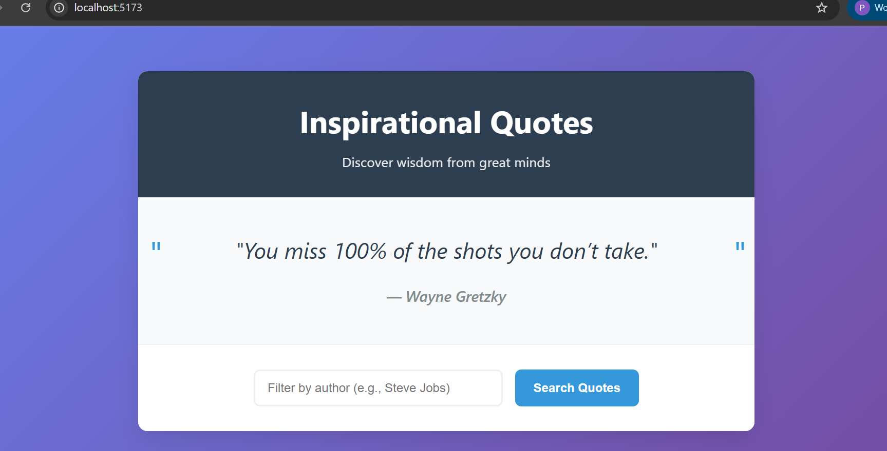

# Training

[](https://github.com/Maximus-Technologies-Uganda/Training/actions/workflows/review-packet.yml)

Monorepo containing multiple small apps and exercises (`quote/`, `expense/`, `stopwatch/`, `todo/`, `frontend/`, and more).

## Quickstart

Prerequisites:

- Node.js 18+
- Git

From the repo root:

```bash
# install root tools and run the monorepo test runner
npm ci
npm test
```

### Spec Kit (Specify) integration

Slash commands are available via your AI assistant (Cursor/Copilot) using the prompts in `.github/prompts`.

Non-interactive CLI setup (Windows/PowerShell):

```powershell
# one-time: ensure uv is available
python -m pip install --user uv

# run Specify CLI (examples)
python -m uv tool run --from git+https://github.com/github/spec-kit.git specify init --here --ai cursor --script ps --ignore-agent-tools --no-git

# create or update a spec in Cursor/Copilot chat
/specify Build a todo filtering feature by status and text search

# generate an implementation plan
/plan Use React state + URL params; add tests and docs

# generate tasks from artifacts
/tasks Generate dependency-ordered tasks for the above plan
```

Relevant files and scripts:

- `.github/prompts/specify.prompt.md`, `plan.prompt.md`, `tasks.prompt.md`
- `.specify/templates/*.md` (templates used by prompts)
- `.specify/scripts/powershell/*.ps1` (helper scripts invoked by prompts)

Frontend (unit tests with coverage):

```bash
cd frontend
npm ci
npm run test:run -- --coverage
```

## Live Demo

🚀 **Try the To-Do Mini Project live**: [https://maximus-technologies-uganda.github.io/maximus-training-patrick-mirror/frontend/todo.html](https://maximus-technologies-uganda.github.io/maximus-training-patrick-mirror/frontend/todo.html)



Features:
- Add, toggle, and delete tasks
- Search and filter by due date and priority
- Export tasks to CSV
- Persistent storage with LocalStorage
- Full accessibility support (WCAG AA)

## Test Coverage

📊 **Coverage Report**: [./frontend/coverage/lcov-report/index.html](./frontend/coverage/lcov-report/index.html)

- **Core modules**: ≥55% statement coverage required
- **UI modules**: ≥40% statement coverage required
- **Overall coverage**: [](frontend/coverage/lcov-report/index.html)

Coverage is enforced via CI with detailed per-file reporting and automated gates.

## Deployment & Quality

- Live deployment: https://maximus-technologies-uganda.github.io/maximus-training-patrick-mirror/
- UI preview:

  [](https://maximus-technologies-uganda.github.io/maximus-training-patrick-mirror/)

Local development server:

```bash
cd frontend
npm ci
npm run dev
```

## Coverage Index

- Open the frontend HTML coverage index directly: [frontend/coverage/lcov-report/index.html](frontend/coverage/lcov-report/index.html)
- CI posts a coverage summary for the frontend to the PR job summary and comments.
- The full HTML coverage report is bundled in the "Review Packet" artifact from CI runs. Download the artifact from a run of the Review Packet workflow and open the coverage report inside (e.g., `frontend/coverage/lcov-report/index.html`).
- Raw summary JSON path in CI: `frontend/coverage/coverage-summary.json`.
- Coverage artifact (CI): See Actions artifacts named "review-packet".

Local HTML report for the frontend:

```bash
cd frontend
npm run test:run -- --coverage
# then open coverage/lcov-report/index.html
```

Each package (`quote/`, `expense/`, `stopwatch/`, `todo/`) also produces coverage when running tests within that package.
